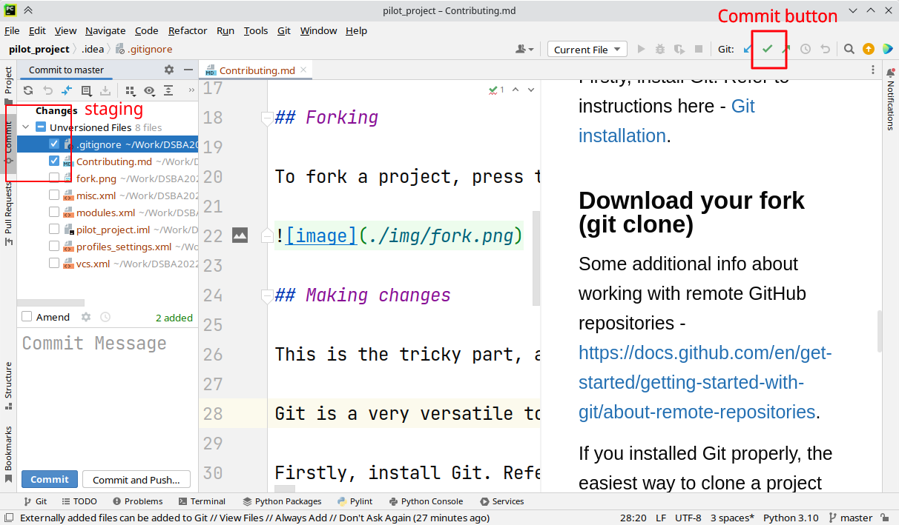
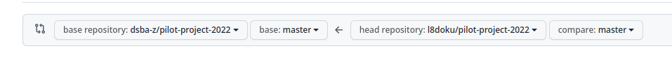

How to add your submissions to this project and get bonus points.

Submissions are sent through *pull requests*. Pull requests are a Git feature that allows you to ask the owner of a project to add your changes. To make a pull request, follow the next steps:

1. **Fork** a project, making your own copy in your account.
2. Make changes to your copy of the project, adding a new feature, fixing bugs, etc.
   1. Download the copy of the project locally (git clone).
   2. Edit the necessary files.
   3. Save your changes in Git (commit).
   4. Upload your changes to your copy of the project (git push).
3. Open the original project and create a new pull request.
4. Check the status of your pull request later, to see if there are some issues you have to fix before it's added to the main project (merged).
5. Fix any problems that were pointed out or provide answers why your code has to be written that way and the fix is incorrect.
6. Wait until the request is merged (or rejected).

Now, with more detail.

## Forking

To fork a project, press the "fork" button on the GitHub page:

## Making changes

This is the tricky part, as it requires working with Git itself.

Git is a very versatile tool, and it's possible to utilize it in many different ways. You can try to have a well organized local project that is constantly connected with the remote repository. You can use Git integration in one of the IDEs you use. You can try to minimize the Git usage, so you only upload with it.

Firstly, install Git. Refer to instructions here - [Git installation](https://git-scm.com/book/en/v2/Getting-Started-Installing-Git).

### Download your fork (git clone)

Some additional info about working with remote GitHub repositories - https://docs.github.com/en/get-started/getting-started-with-git/about-remote-repositories.

If you installed Git properly, the easiest way to clone a project should be using the command `git clone <link>` from the Terminal. To do that, open the folder where you want to put your project. For example `C:\\Intro to programming\project\` or `/Users/georgii/ItP/project/` may do. Then, open Terminal in that folder.

* **Mac**. Short version: locate the folder in Finder, drag and drop it to the Terminal icon. Long version: enable the service to open Terminal in folders. Additional info - https://stackoverflow.com/a/7054045.
* **Windows**. Right click (or hold Shift and then right click) on an empty space inside the folder you need in Explorer. Select "Open in Windows Terminal" or a similar command. "Git Bash" option also works if it's available for you.

Type/paste `git clone https://github.com/<your username>/pilot-project-2022`. It should create a folder `pilot-project-2022`. Open that folder.

### Editing files

There is not much to say about this part. There might be extra Git issues here, but it'll be easier to solve them individually.

### Saving changes to Git (git commit)

This step may be extremely easy or there might be unexpected problems. The main ideas are:

* You need to perform 2 operations here: **stage** and **commit**. Staging means selecting which changes to commit. Commit means saving all the staged changes.
* IDEs usually have convenient buttons for this.
* Git commands for this are `git add <file>` (or `git add .` (with a dot) to stage everything) and `git commit -m "Commit message"`.

In PyCharm, for example, the button "commit" in the top right open a dialog that allows you to select which files you want to commit.

### Uploading your changes.

IDEs usually also have buttons for this feature, but there is also an issue with access rights. You have to enter your GitHub credentials to edit your repository there. However, recently GitHub disabled using login+password for this, so you may need to create an access token. [More information here](https://docs.github.com/en/authentication/keeping-your-account-and-data-secure/creating-a-personal-access-token).

## Making the pull request.

After you made changes and uploaded them to your copy of the project, make a pull request to sent them to the main repository.

Open the "[Pull requests](https://github.com/dsba-z/pilot-project-2022/pulls)" tab of the main repository and click "New pull request". Click the link "Compare across forks" in the text at the top of the page. Then select correct repositories in the gray area in the middle. It should be something like this:

The repository on the left is `dsba-z`, the main repository. The one on the right is yours.

## Fixing problems.

If there are some problems with your changes, your request won't be accepted right away, and instead you will see messages with the requested changes.

To apply the changes, edit the files locally and repeat the steps "Saving changes to Git" and "Uploading your changes". You don't need to update the pull request, your changes are connected there automatically.